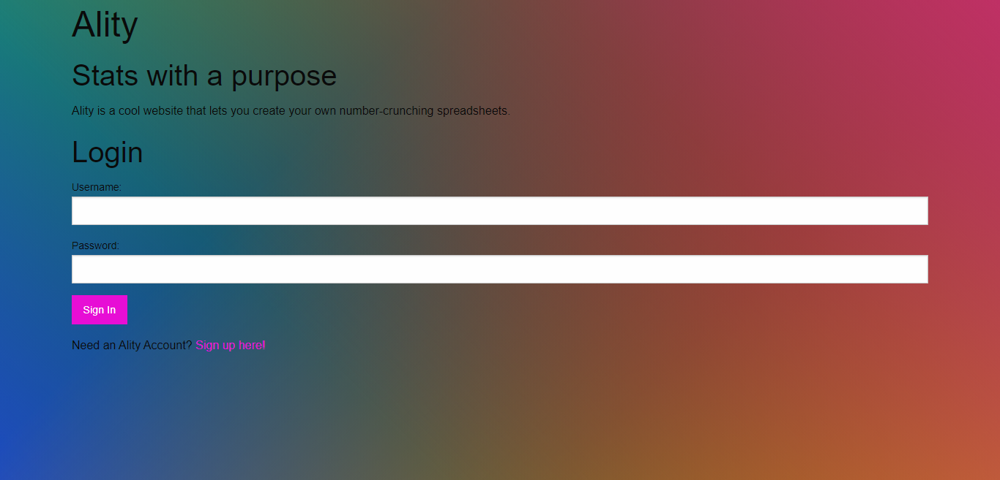
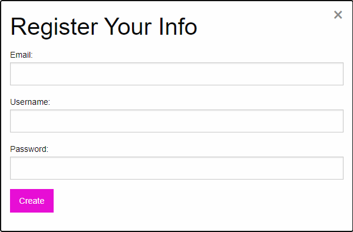
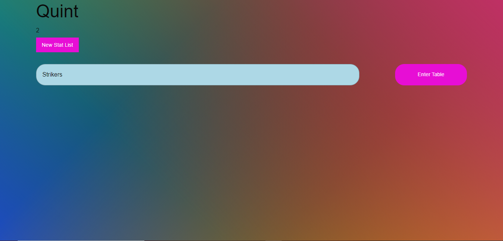
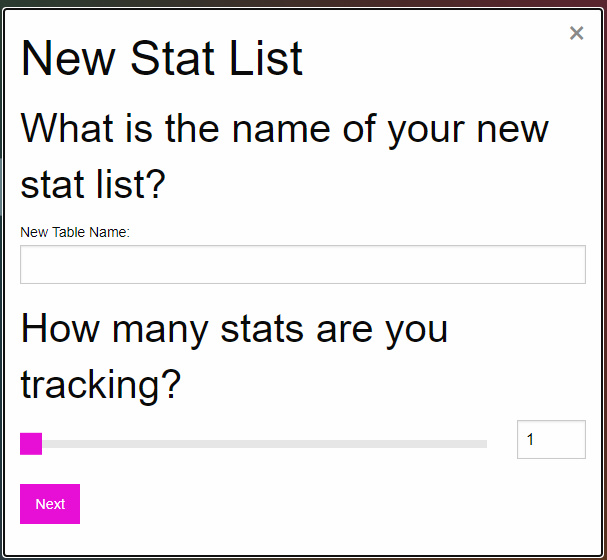
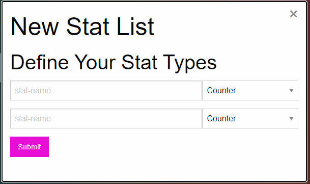
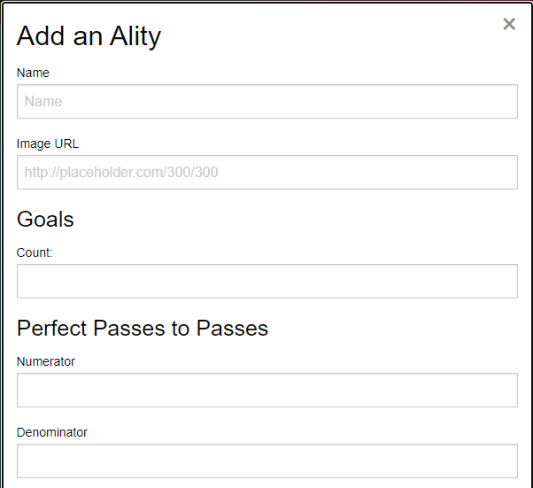
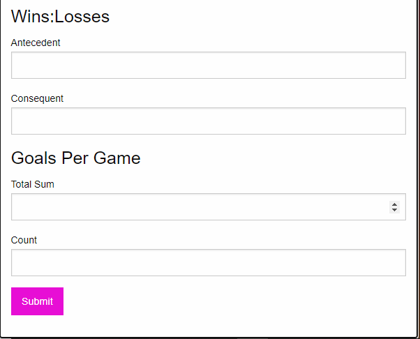
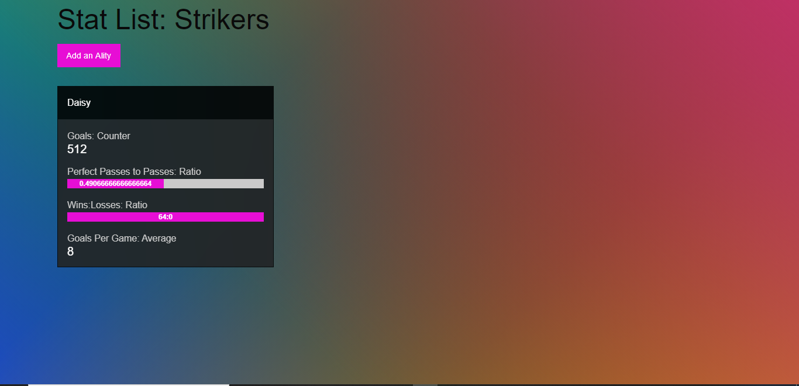
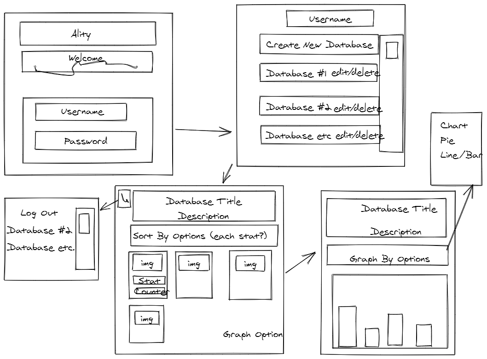
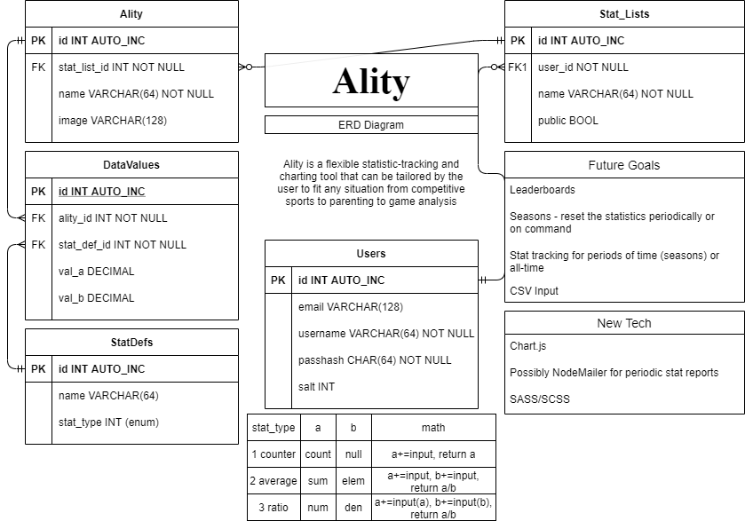

# ality-

## Description
PersonALITY. IndividuALITY. FunctionALITY. Ality is a flexible statistic-tracking and charting tool that can be tailored by the user to fit any situation from competitve sports to parenting to game analysis. No more unwieldy spreadsheets--instead, use Ality for simple, easy-to-use number crunching.

## Table of Contents
* [Installation](#installation)
* [Usage](#usage)
* [Tests](#Tests)
* [Questions/Contributions](#Questions/Contributions)
* [License](#license)
## Installation
Ality is powered by [Express.js](https://www.expressjs.com) with [Handlebars](https://www.handlebarsjs.com). The styling is rendered through [foundation](https://get.foundation/) and [sass](https://sass-lang.com/documentation/js-api), and the database is created and accessed using the [mysql2 NPM package](https://www.npmjs.com/package/mysql2) and the [sequelize ORM](https://sequelize.org/). For further development, [node.js download](https://nodejs.org/en/) with an npm install is required.
## Usage 

Go to [Ality](https://ality-stats.herokuapp.com/), create a user name and password, and follow the prompts to begin creating your customized stat tables and ALITIES. Make your dreams a reALITY. Let's walk through how to use Ality, starting with the homepage.

The Ality homepage should look like the screenshot below when you arrive.

Create a new user account by clicking the "sign up here" link. Otherwise, type in your username and password, and hit the login button to log in. If you click the sign up link, this will pop up:

When you've signed up and logged in, you'll be taken to the User Page where you can create new stat tables or go into one of your previously-created ones. Below is a screenshot of my Users Page. You can click the "New Stat List" button to create a new stat list, and hit the "Enter Table" button on the right of a given stat list to be taken to that stat list.

Clicking the New Stat List button will open up the below modal to fill out some information about the stats you wish to track in this list. Namely, the name of the group of stats you will be tracking, like "Super Mario Strikers" for a stat list that will track Super Mario Strikers data. You will also be asked to declare how many stats this table will track, from 1 to 15.

When you hit "next", a the below modal will pop up and ask you to define the stat types by giving a name for each stat as well as how you will be tracking each stat. You have four options for tracking: a "counter", a "ratio", a "colon ratio", and an "average". This is where you want to make sure you define all your wanted stats as we currently have not added edit functionality to add more stats in a stat table later in the process.

Once you've defined your stat table, you can click "Enter Table" on the Users page to enter it. It will be a relatively blank page with the title of your stat table on top and a button to "Add an Ality" underneath that title. This is where we'll start cooking the stats. Hit the "Add an Ality" button to start.

Now you can start tracking an individual's stats on this page. Most of the time, the ality will be a person. Like the character Daisy in Super Mario Strikers. I want to track the number of goals she scores, how often she makes perfect passes in ratio to regular passes, how often she wins in colon ratio to loses, and how many goals per game she scores. I can just plug those numbers into this modal and have it do the work for me. Add the individual's name and a picture of them for an easy way to look and see who has done what when you've added a bunch of alities to the stat table.

When you've added in your Ality, simply refresh the page, and a card showing all the ality's stats will appear!

Now that you know how to carve your own reALITY, it's time to make your own!

## Tests
There are no tests written at this time.
## Questions/Contributions
For any questions or ideas for contributions, please find us on GitHub or reach out by email: 

[Ality gitHub Page](https://github.com/natewinter/ality)

[Caitlin Bouroncle](mailto:caitlin.bouroncle@gmail.com)

[Quint Turner](mailto:henryquintturner@gmail.com)

[JB](mailto:joshbrown2794@gmail.com)

[Jacob Cowan](mailto:Mrjcowman@gmail.com)

## COLLABORATORS
Jacob Cowan: https://mrjcowman.github.io/

Josh Brown: https://natewinter.github.io/hw-Portfolio/

Caitlin Bouroncle: https://caitlinbou.github.io/myPortfolio1/

Quint Turner: https://pungry.wordpress.com/

## License 

Copyright 2020 
        
Permission is hereby granted, free of charge, to any person obtaining a copy of this software and associated documentation files (the "Software"), to deal in the Software without restriction, including without limitation the rights to use, copy, modify, merge, publish, distribute, sublicense, and/or sell copies of the Software, and to permit persons to whom the Software is furnished to do so, subject to the following conditions:
        
The above copyright notice and this permission notice shall be included in all copies or substantial portions of the Software.
        
THE SOFTWARE IS PROVIDED "AS IS", WITHOUT WARRANTY OF ANY KIND, EXPRESS OR IMPLIED, INCLUDING BUT NOT LIMITED TO THE WARRANTIES OF MERCHANTABILITY, FITNESS FOR A PARTICULAR PURPOSE AND NONINFRINGEMENT. IN NO EVENT SHALL THE AUTHORS OR COPYRIGHT HOLDERS BE LIABLE FOR ANY CLAIM, DAMAGES OR OTHER LIABILITY, WHETHER IN AN ACTION OF CONTRACT, TORT OR OTHERWISE, ARISING FROM, OUT OF OR IN CONNECTION WITH THE SOFTWARE OR THE USE OR OTHER DEALINGS IN THE SOFTWARE. FOR INSTANCE, IF YOU USE ALITY TO KEEP TRACK OF YOUR CREDIT CARDS AND STILL WIND UP IN DEBT, IT'S NOT ON US.

## Wireframe

For those of you who love concept art, here's our original wireframe of Ality that served as our template for the app.

## ERD

Below is our entity relationship diagram, or ERD. It shows all the relationships between the databases that Ality runs on and keeps track of. It even comes with our future goals. If you've got a good idea how to implement them, contact us!

