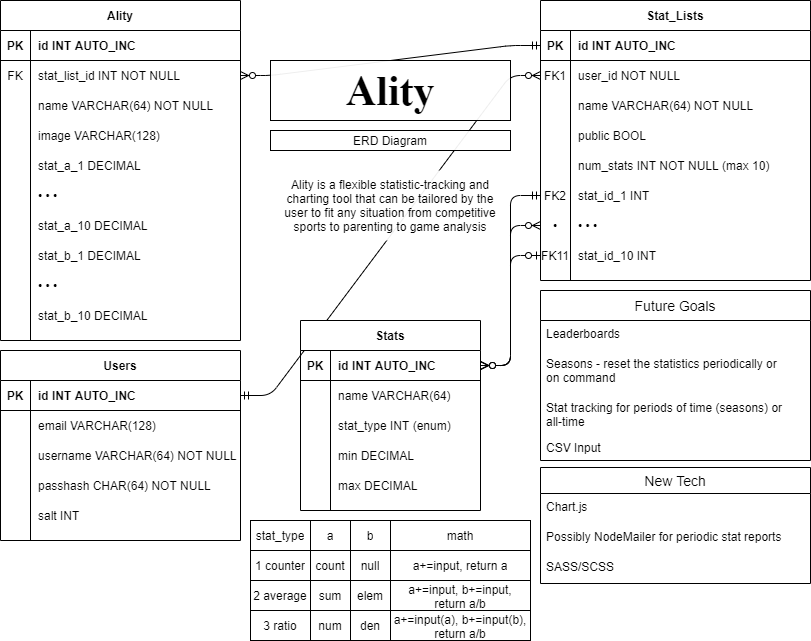

# ality-

Ality is a flexible statistic-tracking and charting tool that can be tailored by the user to fit any situation from competitve sports to parenting to game analysis. 
## Description
This is the best ever stat tracker and Quint will write the real words.
## Table of Contents
* [Installation](#installation)
* [Usage](#usage)
* [Contributing](#Contributing)
* [Tests](#Tests)
* [Questions](#Questions)
* [License](#license)
## Installation
Ality is powered by [Express.js](https://www.expressjs.com) with [Handlebars](https://www.handlebarsjs.com). The styling is rendered through [foundation](https://get.foundation/) and [sass](https://sass-lang.com/documentation/js-api), and the database is created and accessed using the [mysql2 NPM package](https://www.npmjs.com/package/mysql2) and the [sequelize ORM](https://sequelize.org/). For further development, [node.js download](https://nodejs.org/en/) with an npm install is required.
## Usage 
Go to ["WEBPAGE HERE"](), create a user name and password, and follow the prompts to begin creating your customized stat tables and ALITIES. 

## Contributing
We are open to contributions. Please reach out to discuss your ideas.
## Tests
There are no tests written at this time.
## Questions
For any questions please find us on GitHub or reach out by email: 

[ality gitHub page](https://github.com/natewinter/ality)

[email contact](mailto:caitlin.bouroncle@gmail.com)
It doesn't matter who's email contact goes here...

## COLLABORATORS
Jacob Cowan, Josh Brown, Quint Turner, Caitlin Bouroncle
WE SHOULD ADD EMAIL/GITHUB contact here...and probably our personal websites as well, if we want to...

## License 

Copyright 2020 
        
Permission is hereby granted, free of charge, to any person obtaining a copy of this software and associated documentation files (the "Software"), to deal in the Software without restriction, including without limitation the rights to use, copy, modify, merge, publish, distribute, sublicense, and/or sell copies of the Software, and to permit persons to whom the Software is furnished to do so, subject to the following conditions:
        
The above copyright notice and this permission notice shall be included in all copies or substantial portions of the Software.
        
THE SOFTWARE IS PROVIDED "AS IS", WITHOUT WARRANTY OF ANY KIND, EXPRESS OR IMPLIED, INCLUDING BUT NOT LIMITED TO THE WARRANTIES OF MERCHANTABILITY, FITNESS FOR A PARTICULAR PURPOSE AND NONINFRINGEMENT. IN NO EVENT SHALL THE AUTHORS OR COPYRIGHT HOLDERS BE LIABLE FOR ANY CLAIM, DAMAGES OR OTHER LIABILITY, WHETHER IN AN ACTION OF CONTRACT, TORT OR OTHERWISE, ARISING FROM, OUT OF OR IN CONNECTION WITH THE SOFTWARE OR THE USE OR OTHER DEALINGS IN THE SOFTWARE.

## Wireframe

Below is our basic wireframe for the design of this site

## ERD

Below is our basic ERD for the design of the database

